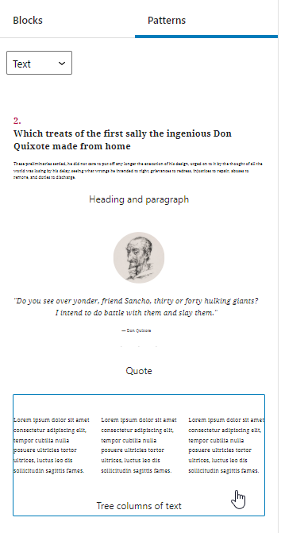

# Neobabis_Gutenberg_Block_Patterns
A simple tutorial plugin to show how to add Block Patterns to Gutenberg.

**Author**: NeoBabis.gr

**Author**: Neokazis Charalampos

**Version**: 1.0

#### Description:

> A simple tutorial plugin to show how to add Block Patterns to Gutenberg.
>
> According to the Block Editor Handbook, the array ($pattern_properties) includes:
>
> **title (required)**: A human-readable title for the pattern.
>
> **content (required)**: Raw HTML content for the pattern.
>
> **description**: A visually hidden text used to describe the pattern in the inserter. A description is optional but it is strongly encouraged when the title does not fully describe what the pattern does.
>
> **categories**: A list of pattern categories used to group block patterns. Block patterns can be shown on multiple categories.
>
> **keywords**: Aliases or keywords that help users discover it while searching.
>
> **viewportWidth**: Specify the width of the pattern in the inserter.

#### Tip
Change the content by your pattern, rename the plugin and make it yours.

You only nead the "Neobabis Gutenberg Block Patterns.php" file. Convert it into a zip file and upload it as a plugin

#### Current result

